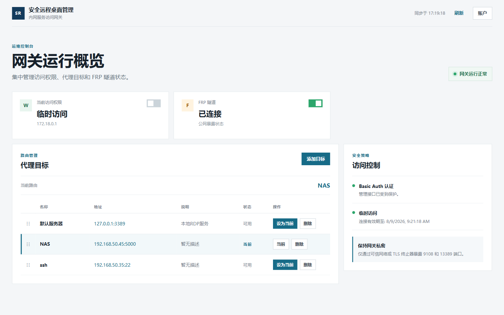

# Secure RDP Manager

Secure RDP Manager 是一个基于 Node.js/Express 的内网服务访问网关，提供 Web 管理界面、TCP 代理、Proxy Protocol v2、IP 白名单和 frpc 内网穿透能力。



## 功能

- 中文 Web 控制台，展示 RDP、白名单和 FRP 隧道状态。
- 管理多个代理目标，支持添加、删除、切换当前目标和拖拽排序。
- TCP 代理支持 RDP、SSH、HTTP/HTTPS 等 TCP 服务。
- HTTP 请求可根据 Host 子域名前缀选择代理目标。
- 支持 Proxy Protocol v2，并记录连接日志。
- 静态白名单和临时白名单。
- Windows 环境下可启用、禁用和自动超时关闭 RDP 服务。
- 集成 frpc 0.70.1，支持 Docker 和 Windows 服务部署。
- Basic Auth 保护所有 Web 和 API 路由。

## 快速开始

### Docker Compose

1. 准备配置文件：

   ```powershell
   Copy-Item config/default.json config/production.json
   Copy-Item config/frpc.toml.example config/frpc.toml
   ```

2. 编辑 `config/production.json` 和 `config/frpc.toml`，至少修改管理密码、frps 地址和 token。

3. 启动：

   ```powershell
   docker compose up -d --build
   ```

4. 访问 `http://localhost:9108`，使用配置中的用户名和密码登录。

查看日志或停止服务：

```powershell
docker compose logs -f
docker compose down
```

### 本地 Node.js

要求 Node.js 18 或更高版本。

```powershell
npm install
npm start
```

开发和生产配置：

```powershell
npm run dev
npm run prod
```

### 更新 NAS 部署

部署参数保存在本地被 Git 忽略的 `deploy-local/deploy-config.json`，不会提交凭据。确认 NAS 已安装 Docker 后，在项目根目录执行：

```powershell
node deploy-local/deploy.js
```

脚本会构建 `jimmy1/secure-frp-proxy:latest`、上传镜像、替换 `jimmy1-secure-frp-proxy2` 容器，并输出启动日志。NAS 的 `config` 和 `log` 目录是持久化挂载，更新镜像不会删除运行配置。

## 配置

默认配置文件为 `config/default.json`，生产环境通常使用 `config/production.json`。可通过 `CONFIG_DIR` 指定配置目录。

```json
{
  "PORT": 9108,
  "TCP_PROXY_PORT": 13389,
  "USERNAME": "admin",
  "PASSWORD": "请替换为强密码",
  "PROXY_TARGETS": [
    {
      "id": "default",
      "name": "默认服务器",
      "host": "127.0.0.1",
      "port": 3389,
      "description": "本地 RDP 服务"
    }
  ],
  "CURRENT_PROXY_TARGET": "default"
}
```

支持的环境变量：

| 变量 | 说明 |
| --- | --- |
| `NODE_ENV` | `default` 或 `production` |
| `CONFIG_DIR` | 配置文件目录 |
| `PORT` | Web 管理端口，默认 `9108` |
| `TCP_PROXY_PORT` | TCP 代理端口，默认 `13389` |
| `APP_USERNAME` | Basic Auth 用户名，覆盖配置文件 |
| `APP_PASSWORD` | Basic Auth 密码，覆盖配置文件 |
| `TRUST_PROXY` | 设为 `true` 时信任受控反向代理的 `X-Forwarded-For` |

配置会在启动时校验端口、凭据和代理目标；Web 修改配置时使用原子写入，避免并发写坏 JSON。

## frpc 配置

仓库内置 Linux 和 Windows amd64 客户端，当前版本为 `0.70.1`。

```powershell
Copy-Item config/frpc.toml.example config/frpc.toml
```

编辑 `config/frpc.toml`：

- 设置 `serverAddr`、`serverPort` 和 `auth.token`。
- Web 管理代理的 `localPort` 应为 `9108`。
- TCP 代理的 `localPort` 应为 `13389`。
- `remotePort` 必须是 frps 上未被占用的端口。
- 每个 `[[proxies]]` 的 `name` 必须唯一。

frpc 日志中看到 `login to server success` 且每个代理出现 `start proxy success`，表示隧道已建立。

### HTTPS 独立通道

HTTPS 不使用原有的 `frpc.toml` 或 RDP/TCP 通道。启用时需要创建独立配置：

```powershell
Copy-Item config/frpc-https.toml.example config/frpc-https.toml
```

在 `frpc-https.toml` 中设置独立的代理名称和 `remotePort`，并保持 `localPort = 9443`。不要为该代理配置 `transport.proxyProtocolVersion = "v2"`，否则 TLS 握手会失败。

应用配置示例：

```json
{
  "HTTPS_TERMINATOR": {
    "enabled": true,
    "port": 9443
  }
}
```

HTTPS Terminator 当前仅支持 HTTP/1.1。证书路径固定为 `config/certs/privkey.key` 和 `config/certs/fullchain.cer`；Docker 已挂载整个 `config` 目录，因此无需配置额外卷或证书路径。证书目录已被 Git 忽略。HTTPS 独立 frpc 配置可通过 `FRPC_HTTPS_CONFIG` 指定路径。

例如公网入口配置为 `remotePort = 9943` 时，访问地址为 `https://<目标名称>.<域名>:9943/`。证书的 SAN 必须覆盖完整访问域名。HTTPS 原始 TCP 通道不会携带客户端 IP；通过 frp HTTP 代理访问管理页面时，只有在受控代理可信的情况下设置 `TRUST_PROXY=true`，应用才会读取 `X-Forwarded-For`。

## Web 控制台

- 状态总览：查看 RDP、当前 IP 白名单和 FRP 隧道。
- 代理目标：通过表格管理目标，拖动行即可调整顺序，顺序会保存到配置文件。
- 访问控制：将当前客户端 IP 加入或移出白名单。
- 账户：修改用户名和密码，密码至少 12 位。

## API

所有 API 都需要 Basic Auth。

| 方法 | 路径 | 作用 |
| --- | --- | --- |
| `GET` | `/api/page-data` | 获取状态总览 |
| `GET` | `/api/proxy-targets` | 获取代理目标 |
| `POST` | `/api/proxy-targets` | 添加目标 |
| `POST` | `/api/proxy-targets/reorder` | 保存目标排序 |
| `POST` | `/api/proxy-targets/:id/set-current` | 设置当前目标 |
| `DELETE` | `/api/proxy-targets/:id` | 删除目标 |
| `POST` | `/api/joinwhitelist` | 加入白名单 |
| `POST` | `/api/removewhitelist` | 移出白名单 |
| `POST` | `/api/openproxy` / `/api/closeproxy` | 控制 frpc 代理 |
| `POST` | `/api/change-password` | 修改登录凭据 |

## 目录结构

```text
src/app.js                    应用入口
src/routes/                   Web 和 API 路由
src/services/                 TCP、RDP、HTTPS、frpc 服务
src/utils/                    配置和认证工具
public/                       Web UI 静态资源
config/                       运行配置和模板
frpc/                         frpc 可执行文件
log/                          连接日志
Dockerfile                    Docker 镜像
docker-compose.yml            Compose 编排
```

## 安全建议

- 不要提交真实的 `config/production.json`、`config/frpc.toml`、`config/whitelist.ini` 或日志文件。
- 首次部署必须替换默认密码，并通过环境变量或 secret 注入生产凭据。
- 管理端建议放在 HTTPS 或可信内网之后，不要直接暴露到公网。
- 仅在使用可信反向代理时设置 `TRUST_PROXY=true`。
- 为每个 frpc 代理使用唯一名称和未占用的远端端口。
- 定期更新 Node.js、frpc 和基础镜像。

## Windows 服务

```powershell
npm run install-service
npm run uninstall-service
```

RDP 服务控制需要管理员权限；非 Windows 环境不会执行 Windows 注册表操作。

## 许可证

ISC
